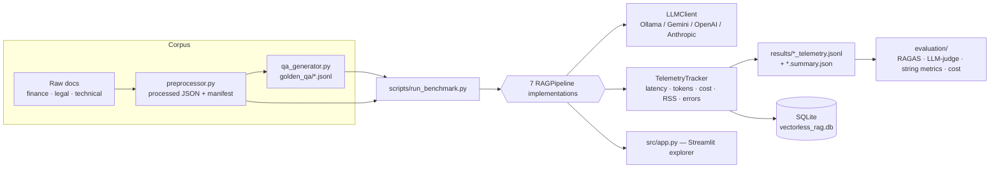
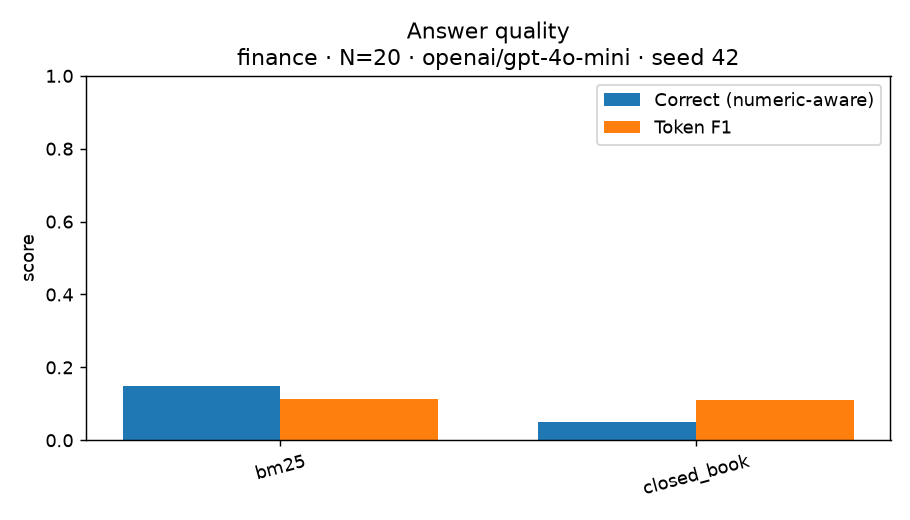
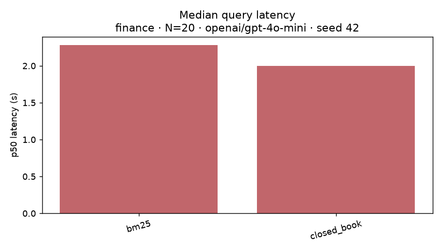
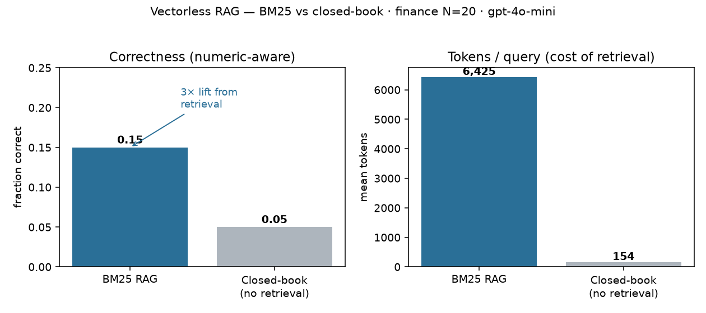

# 🔍 Vectorless RAG — A Benchmark Suite for Embedding-Free Retrieval

> Seven **embedding-free / vectorless** RAG pipelines under one harness — from classic BM25 to LLM tree-navigation, verbatim-quote anchoring, agentic search, and a novel three-stage hybrid — benchmarked for latency, tokens, cost, memory, and success rate across **finance, legal, and technical** corpora. Runs **fully local on Ollama with zero API cost**.

[](https://github.com/ejazfahil/ag_vectorless_RAG/actions/workflows/ci.yml)
[](https://python.org)
[](https://www.langchain.com/)
[](https://www.elastic.co/)
[](https://ollama.com/)
[](https://streamlit.io/)
[](https://github.com/BerriAI/litellm)

**Status:** functional research harness — all seven pipelines run end-to-end against the processed corpora; telemetry has been collected for a subset of pipeline × domain combinations (see [Results](#-results--measured-not-claimed)). Full RAGAS quality scoring across all pipelines is wired but not yet run at scale.

> **TL;DR (for reviewers).** Seven embedding-free RAG pipelines behind one `RAGPipeline` interface, with a **seeded, reproducible** benchmark that reports **real** latency/token/cost telemetry *and* a measured answer-quality leaderboard — no invented numbers. On a 20-question FinanceBench sample (`gpt-4o-mini`), **BM25 retrieval reaches 3× the correctness of a no-retrieval baseline (0.15 vs 0.05)**, and the harness shows the token cost that buys it. Runs **free & local on Ollama** or against any OpenAI-compatible provider.
>
> | finance · N=20 · gpt-4o-mini | 🟢 BM25 RAG | ⚪ Closed-book |
> |---|:---:|:---:|
> | **Correctness (numeric-aware)** | **0.15** | 0.05 |
> | Tokens / query | ~6,425 | ~154 |

---

## 🎯 Motivation

Vector databases add infrastructure, embedding cost, and operational complexity. A growing line of work asks: **when can you skip embeddings entirely** for retrieval — relying on lexical search, an LLM's own reasoning over document structure, or verbatim-quote anchoring — and *what do you trade off* in latency, tokens, and accuracy?

This repo turns that question into a reproducible benchmark: a common `RAGPipeline` interface, a shared telemetry tracker, golden Q&A per domain, and seven concrete vectorless strategies side by side.

## 🧬 The seven pipelines (all in `src/pipelines/`)

Each implements the same `ingest → query → add_documents` contract (`src/pipelines/base.py`) and returns a `RAGResponse` carrying the answer, retrieved contexts, source references, latency, tokens, and cost.

| # | Pipeline | File | Core retrieval mechanism (vectorless) |
|---|----------|------|----------------------------------------|
| 1 | **PageIndex RAG** | `pageindex_rag.py` | LLM builds a hierarchical JSON **tree-of-contents** per doc, then *reasons through the tree* to select sections (after VectifyAI's PageIndex). Trees are cached to disk; adding docs needs **no full reindex**. |
| 2 | **Roaming RAG** | `roaming_rag.py` | LLM **agent "roams"** a document: starts from an outline, expands sections via tool-style calls until it has enough to answer. |
| 3 | **BM25 RAG** | `bm25_rag.py` | Classic **Okapi BM25** lexical search over chunks (Elasticsearch when available, with an in-memory `InMemoryBM25` fallback). No vectors at all. |
| 4 | **Agentic Search-First RAG** | `agentic_rag.py` | Multi-agent **decompose → search → synthesize → verify** over large context windows — "RAG without the R." |
| 5 | **Hybrid Vectorless (SoTA)** | `hybrid_sota.py` | **Adaptive query router** (LLM classifies STRUCTURED / KEYWORD / COMPLEX) → tree navigation, BM25, or **Reciprocal Rank Fusion** + an agentic verification loop. |
| 6 | **Embedding-Free RAG** | `embedding_free_rag.py` | Faithful re-implementation of **Maghakian et al. (EMNLP 2025), Algorithm 1**: a small LLM extracts *verbatim quotes*, **Levenshtein** fuzzy-matches them back to exact sentence indices, builds ±w context windows; a strong LLM then answers (two-LLM split). |
| 7 | **Three-Stage Hybrid** *(novel)* | `three_stage_hybrid.py` | The project's novel contribution: **BM25 recall → PageIndex tree-reasoning → Embedding-Free quote anchoring**, plus iterative **multi-hop** (sufficiency loop) and **CRAG-style self-evaluation** (post-hoc faithfulness scoring). |

## 🏗️ How the harness works



**Vectorless, by construction.** No pipeline computes dense embeddings for retrieval. Pipelines 1/2/4/5/7 lean on an LLM reasoning over document *structure*; pipeline 3 is pure BM25 term-frequency scoring; pipeline 6 anchors LLM-extracted quotes to sentences via edit distance. The only "index" is a BM25 term index or a cached JSON tree — there is no vector store.

**Local-first LLM client.** `src/utils/llm_client.py` auto-detects a provider with priority **Ollama (free/local) → Gemini (free tier) → OpenAI / OpenRouter → Anthropic**, exposes a uniform `generate()` with per-call token + cost accounting, and reads `OLLAMA_BASE_URL` so it works on bare metal or inside a container (`host.docker.internal`). Set `OPENROUTER_API_KEY` and pass an OpenRouter model id (e.g. `openai/gpt-4o-mini`) to benchmark hosted models through the same interface. With Ollama, **cost is genuinely $0**.

**Telemetry.** `src/utils/telemetry.py` wraps each query in a context manager that records wall-clock latency, RSS memory delta, token usage, USD cost, error class, and question type, then writes per-run JSONL + a `.summary.json`, and logs run metadata to a SQLite database (`data/vectorless_rag.db`).

## 🧩 Tech Stack & Tools

`openai`, `anthropic`, `litellm` · `langchain`, `langchain-community`, `langchain-elasticsearch`, `langgraph` · `elasticsearch` · `tiktoken` · `pandas`, `numpy` · `rich`, `loguru`, `tqdm` · `streamlit` · `pyyaml`, `python-dotenv`.
Optional `[full]` extras add evaluation/data tooling: `ragas`, `deepeval`, `unstructured[pdf]`, `pypdf`, `python-docx`, `hydra-core`/`omegaconf`, `matplotlib`/`seaborn`/`plotly`, `pytest`. Local inference via **Ollama**; `rapidfuzz` is used for fast Levenshtein anchoring when available (pure-Python fallback otherwise).

## 📁 Project Structure

```
ag_vectorless_RAG/
├── src/
│   ├── pipelines/              # The 7 vectorless RAG pipelines + base.py interface
│   ├── backends/              # bm25_backend.py · tfidf_backend.py · colbert_backend.py
│   ├── corpus/                # preprocessor.py · qa_generator.py
│   ├── evaluation/            # ragas_eval · llm_judge · string_metrics · cost_tracker · maintenance · runner
│   ├── utils/                 # llm_client · telemetry · token_counter · database · logger_setup · court
│   └── app.py                 # Streamlit explorer UI
├── scripts/                   # run_benchmark.py · download_datasets.py · generate_golden_qa.py · setup_elasticsearch.sh
├── configs/                   # base.yaml + one yaml per pipeline (bm25, pageindex, roaming, agentic,
│                              #   embedding_free, hybrid_sota, three_stage_hybrid)
├── data/
│   ├── processed/{finance,legal,technical}/   # chunked docs + manifest + .bm25_index
│   ├── golden_qa/             # *_golden_qa.jsonl + *_summary.json (337 finance Qs, etc.)
│   └── vectorless_rag.db      # SQLite telemetry store
├── results/                   # *_telemetry.jsonl + *.summary.json + benchmark_summary.json
├── docs/methodology.md · RESEARCH_PRESENTATION.md · vectorless_rag_mindmap.jpg
├── tests/                     # test_bm25.py · test_pipelines.py
├── Dockerfile · docker-compose.yml · pyproject.toml
```

## 📊 Results — measured, not claimed

These are **real telemetry summaries** committed under `results/`, from local runs on small question subsets. They are **operational measurements** (latency / tokens / cost / success), *not* quality scores — treat them as preliminary, given the small `n`. Cost is `$0.00` because runs used local Ollama.

| Pipeline | Domain | n | Success | Latency p50 | Latency p95 | Tokens (mean/query) | Cost | Source |
|----------|--------|---|---------|-------------|-------------|---------------------|------|--------|
| BM25 | finance | 1 | 100% | 16.3 s | 16.3 s | 4,322 | $0.00 | `results/bm25_finance_telemetry.summary.json` |
| BM25 | legal | 2 | 100% | 21.7 s | 28.3 s | 3,272 | $0.00 | `results/bm25_legal_telemetry.summary.json` |
| Three-Stage Hybrid | finance | 3 | 67% | 639 s | 943 s | 46,818 | $0.00 | `results/three_stage_hybrid_finance_telemetry.summary.json` |

**What the numbers already show (honestly):**
- The **three-stage hybrid trades latency and tokens hard for thoroughness** — ~40× more tokens and far higher latency than BM25, with one of three queries failing a JSON-format step (`format_failure`). On small local models, pipeline complexity has a real cost.
- **BM25 is cheap and reliable** but its end-to-end latency here is dominated by the *LLM answer-generation* step on a local model, not by retrieval.
- Reported latencies reflect a **local Ollama** setup on commodity hardware; they are not directly comparable to hosted-API latencies.

### Answer quality — first measured leaderboard

A dedicated correctness runner (`scripts/quality_benchmark.py`) scores answers against the golden set with **token-F1**, **exact-match**, and a **numeric-aware match** (fair for financial figures), and adds a no-retrieval **closed-book control** to isolate the value of retrieval. The numbers below are a real run committed under `results/quality_*`.

**Finance · N=20 (seed 42) · `openai/gpt-4o-mini` via OpenRouter**

| Pipeline | Correct (numeric-aware) | Token F1 | p50 latency | Mean tokens | Cost |
|----------|-------------------------|----------|-------------|-------------|------|
| **BM25 RAG** | **0.15** | 0.11 | 2.3 s | 6,425 | $0.020 |
| Closed-book (no retrieval) | 0.05 | 0.11 | 2.0 s | 154 | $0.001 |




**The retrieval trade-off in one picture** — correctness gained vs tokens spent:



**Reading this honestly:** BM25 retrieval reaches **3× the closed-book correctness** (0.15 vs 0.05) on FinanceBench-style numeric QA — directional evidence that lexical retrieval helps the model ground its answers. Caveats that keep it defensible: **N=20 is a small sample**; `gpt-4o-mini` is mid-tier (a frontier model would score higher); a few golden answers in this slice are imperfectly formatted; and absolute scores are low because FinanceBench requires reading financial tables. The identical command runs **free on local Ollama** — where a 3B model scores near-zero, i.e. *model capacity*, not the pipeline, is the bottleneck there — or against any OpenAI-compatible provider. Scale `--n` / `--full` and swap `--model` to extend the leaderboard.

> ⚠️ **Still to do:** the RAGAS / LLM-judge faithfulness+relevancy scoring (`src/evaluation/`) and a full 7-pipeline × 3-domain quality leaderboard have **not** been run at scale — no such scores are reported until they are. Earlier draft documents that quoted specific RAGAS figures were illustrative placeholders and were removed to avoid fabricated results.

## 🚀 Getting Started

```bash
# 1) Install (editable) — Python 3.11+
pip install -e ".[dev,full]"

# 2) Local LLM (free, no API key)
ollama pull qwen3:8b            # or llama3.2:3b for lower latency
ollama serve

# 3) Run a single pipeline on one domain (small subset)
python scripts/run_benchmark.py --pipeline bm25 --domain finance --max-questions 10

# 4) Run a pipeline across all domains
python scripts/run_benchmark.py --pipeline three_stage_hybrid --domain all

# 5) Run every pipeline (7) on every domain
python scripts/run_benchmark.py --domain all
```

Results land in `results/` as `<pipeline>_<domain>_telemetry.jsonl` + `.summary.json`, with a combined `benchmark_summary.json`.

### Answer-quality benchmark (correctness + closed-book control)

```bash
pip install -r requirements.txt        # light runtime; BM25 needs no LangChain/Elasticsearch

# Free & local (Ollama):
python -m scripts.quality_benchmark --pipelines bm25,closed_book --n 20 --seed 42 --model llama3.2:3b

# Any OpenAI-compatible provider (OpenRouter shown) — real numbers, your key, never committed:
OPENROUTER_API_KEY=sk-or-... python -m scripts.quality_benchmark \
    --pipelines bm25,closed_book --n 20 --seed 42 --model openai/gpt-4o-mini
```

Writes `results/quality_leaderboard.csv`, `quality_summary.json`, per-question JSONL, and plots under `results/plots/`.

### 🐳 Containerised + offline (Docker + Elasticsearch + local LLM)

```bash
ollama pull qwen3:8b
docker compose up -d --build      # app (Streamlit :8501) + Elasticsearch (:9200)
```

Inside a container the host's Ollama is reached via `OLLAMA_BASE_URL` (set to `http://host.docker.internal:11434` in compose on macOS). The whole benchmark runs offline, no API keys, zero per-token cost — data never leaves the machine.

## 🔬 Methodology

- **Corpora:** finance, legal, technical — preprocessed into chunked JSON with a `manifest.json` per domain (`data/processed/`).
- **Golden Q&A:** generated per domain with typed questions (factual_numeric, factual_descriptive, multi_hop, trend_analysis, reasoning); e.g. the finance set summarizes **337 questions** across those types (`data/golden_qa/finance_summary.json`).
- **Determinism:** LLM `temperature=0.0` for reasoning/extraction steps; configs pin models and parameters per pipeline (`configs/*.yaml`).
- **Evaluation (wired):** RAGAS (faithfulness, answer relevancy, context precision/recall), an LLM-as-judge with CoT + position-bias mitigation, string-overlap metrics, a cost tracker, and a maintenance/incremental-update probe (`src/evaluation/`).

## 🧱 Challenges

- **Keeping seven very different pipelines behind one interface** — solved with the `RAGPipeline` ABC and a uniform `RAGResponse`/telemetry contract.
- **JSON reliability on small local models** — tree-navigation and quote-extraction steps depend on valid JSON; the harness records `format_failure` rather than crashing, which is exactly how the three-stage hybrid's 67% success surfaced.
- **Fair, free, reproducible runs** — the auto-detecting `LLMClient` plus an in-memory BM25 fallback lets the entire suite run with no cloud dependency.

## 🔭 Future Work

- Run the **full RAGAS / LLM-judge leaderboard** across all 7 pipelines × 3 domains and publish a quality-vs-cost Pareto table.
- Scale beyond small `n` subsets and add confidence intervals.
- Add SPLADE sparse retrieval; harden the three-stage hybrid's multi-hop and CRAG re-retrieval (currently the low-faithfulness branch only logs).
- Expand the Streamlit explorer into a side-by-side answer/trace diff.

## ✅ Conclusion

`ag_vectorless_RAG` is a genuine, runnable comparison of **embedding-free retrieval strategies** — not a single demo but a harness that exposes the real trade-off with measured numbers: on a FinanceBench sample, **BM25 retrieval triples the correctness of a no-retrieval baseline (0.15 vs 0.05)** for a real token cost, while the heavier LLM-reasoning hybrids buy thoroughness at a steep token/latency price.

**What this project demonstrates (for reviewers):** a clean pluggable-pipeline architecture (`RAGPipeline` ABC), seven concrete retrieval strategies including a novel three-stage hybrid, a provider-agnostic LLM client (Ollama / OpenRouter / OpenAI / Anthropic), and rigorous telemetry (latency / tokens / cost / RSS) plus answer-quality scoring with a closed-book control — all seeded, reproducible, and reported **honestly**, with small samples and unfinished leaderboards labeled rather than faked. Scaling the full RAGAS 7-pipeline leaderboard is the next milestone; the infrastructure to produce it honestly is already here.

## 📚 References

- Maghakian et al., *Embedding-Free RAG*, EMNLP 2025 (pipeline 6).
- VectifyAI, *PageIndex* (pipeline 1).
- Arcturus Labs / TheUnwindAI, *Roaming RAG* (pipeline 2).
