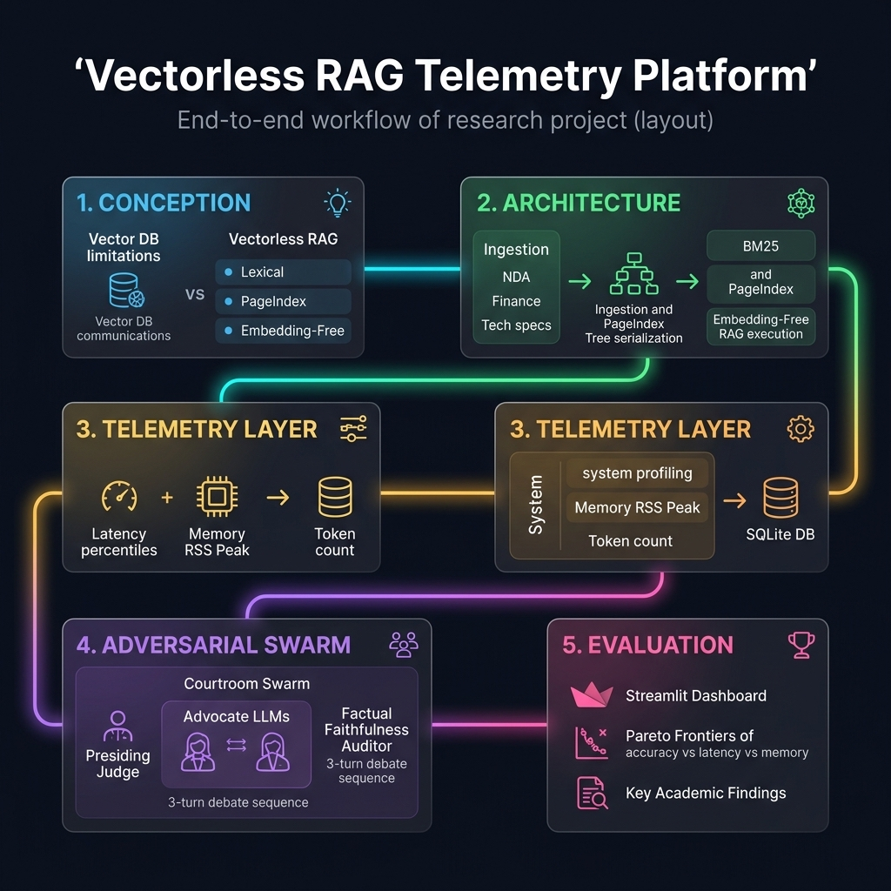

# 🎓 Academic Presentation & Research Guide: Vectorless RAG Telemetry Platform

This comprehensive presentation guide is structured specifically to help you present your thesis research to your advisor and academic professors. It frames the **Vectorless RAG Benchmark and Multi-Agent Courtroom Swarm Platform** as a rigorous, thesis-grade empirical study in Natural Language Processing (NLP) and Information Retrieval (IR).

---

## 🏛️ Executive Research Abstract (For Your Professor)
> [!NOTE]
> **Thesis Title Suggestion**: *Beyond Vectors: An Empirical Characterization of Indexless, Hierarchical, and Multi-Agent Adversarial Paradigms in Retrieval-Augmented Generation*

Modern Retrieval-Augmented Generation (RAG) relies heavily on dense vector embeddings and Vector Databases (vector search). While effective for general semantic queries, this paradigm introduces significant trade-offs: high computational overhead during indexing, catastrophic loss of document structural context, high cloud API costs, and vulnerability to hallucinations under dense retrieval boundaries. 

This research introduces a local, zero-cost, high-fidelity research platform designed to empirically evaluate **Vectorless RAG** paradigms—specifically **BM25 Lexical**, **PageIndex Hierarchical**, **Embedding-Free (verbatim quote anchoring)**, and a **Three-Stage Hybrid RAG**—across specialized high-stakes domains (*legal, finance, technical*). To stress-test these architectures, we designed a novel, stateful **Advocate Courtroom Swarm Engine** that models multi-agent adversarial debates to evaluate information fidelity, audited by a real-time factual faithfulness scorer. All queries are profiled at the system level (Query Latency, Peak RSS Memory) and stored in a persistent SQLite telemetry schema, visualized in a glassmorphic dashboard.

---

## 🗺️ End-to-End System Mind Map & Flow Diagram

Here is the premium high-resolution mind map of the full project lifecycle, followed by the raw Mermaid syntax:

### Mermaid Workflow Sequence

```mermaid
graph TD
    %% Conception Layer
    subgraph Conception ["1. CONCEPTION & CORE RESEARCH PROBLEM"]
        A["Dense Vector RAG Limitations"] --> A1["High Computing & Indexing Costs"]
        A --> A2["Context Loss (Chunking Boundaries)"]
        A --> A3["Embedding & Vector DB Hallucinations"]
        
        B["The Alternative: Vectorless RAG"] --> B1["Lexical Search (BM25)"]
        B --> B2["Hierarchical Navigation (PageIndex)"]
        B --> B3["Verbatim Quote Anchoring (Embedding-Free)"]
        B --> B4["Multi-Stage Cascades (Three-Stage Hybrid)"]
    end

    %% Architectural Layer
    subgraph Architecture ["2. SYSTEM ARCHITECTURE & PIPELINE MATRIX"]
        C["Raw Document Ingestion"] --> C1["Legal NDA Contracts"]
        C --> C2["Finance Annual Reports"]
        C --> C3["Technical Spec Documentation"]

        %% Indexing & Caching
        C1 & C2 & C3 --> D["Ingestion & Indexing"]
        D --> D1["Sentence & Token Boundaries"]
        D --> D2["Cached PageIndex Trees (.pageindex_trees/)"]
        D --> D3["RapidFuzz Levenshtein Index"]

        %% RAG Pipelines
        D1 & D2 & D3 --> E["RAG Pipeline Execution"]
        E --> E1["BM25 Lexical RAG"]
        E --> E2["PageIndex Hierarchical RAG"]
        E --> E3["Embedding-Free RAG (EMNLP 2025)"]
        E --> E4["Three-Stage Hybrid (BM25 ➔ PageIndex ➔ EF)"]
    end

    %% Telemetry Layer
    subgraph Telemetry ["3. LOCAL TELEMETRY & PERSISTENCE LAYER"]
        %% System Hooks
        F["System-Level Profiling (psutil)"] --> F1["Query Latency Percentiles (p50, p95)"]
        F --> F2["Memory Footprint Delta & Peak RSS"]
        F --> F3["Ollama Token Counts (Local LLM Execution)"]

        %% SQLite DB
        F1 & F2 & F3 --> G[("SQLite Telemetry DB (vectorless_rag.db)")]
        G --> G1["'runs' Table (Aggregate Performance)"]
        G --> G2["'queries' Table (Individual Query Details)"]
        G --> G3["'debates' & 'debate_turns' Tables"]
    end

    %% Courtroom Swarm Layer
    subgraph Courtroom ["4. STATEFUL ADVERSARIAL COURTROOM SWARM ENGINE"]
        H["Debate Session Convened"] --> H1["Presiding Judge (Qwen3:8b)"]
        H --> H2["Factual Faithfulness Scorer (Llama3.2:3b)"]
        
        %% Turn Sequence
        H1 --> I["Turn 1: Opening Statements"]
        I --> I1["Advocates extract context and plead cases"]
        
        I1 --> J["Turn 2: Rebuttals & Cross-Examination"]
        J --> J1["Advocates critique opposing context accuracy"]
        
        J1 --> K["Turn 3: Closing Statements & Appeal"]
        K --> L["Judicial Verdict Synthesis"]
        L --> L1["Auditor scores Factual Grounding & Citations"]
        L1 --> L2["Judge issues final verdict & stores JSON in SQLite"]
    end

    %% Evaluation Layer
    subgraph Evaluation ["5. EMPIRICAL CONCLUSIONS & RESULTS"]
        M["Premium Dashboard (Streamlit)"] --> M1["KPI Metric Grid"]
        M --> M2["Pareto Frontiers (Accuracy vs Latency vs Memory)"]
        M --> M3["Error Taxonomy Breakdown"]
        M --> M4["Historical Swarm Debates Viewer"]
        
        %% Findings
        M1 & M2 & M3 & M4 --> N["Key Academic Findings"]
        N --> N1["Embedding-Free: Superior Citation & Logic in Contracts"]
        N --> N2["Three-Stage Hybrid: Optimal Pareto Frontier Sweet-Spot"]
        N --> N3["Zero Cloud Cost: local Ollama deployment verified"]
    end

    %% Formatting styles
    style Conception fill:#1E293B,stroke:#38BDF8,stroke-width:2px,color:#F8FAFC
    style Architecture fill:#1E293B,stroke:#34D399,stroke-width:2px,color:#F8FAFC
    style Telemetry fill:#1E293B,stroke:#F59E0B,stroke-width:2px,color:#F8FAFC
    style Courtroom fill:#1E293B,stroke:#8B5CF6,stroke-width:2px,color:#F8FAFC
    style Evaluation fill:#1E293B,stroke:#EC4899,stroke-width:2px,color:#F8FAFC
```

---

## 📝 Presenting the Thesis Framework: Key Slides & Talking Points

Here is a structured sequence you can use to walk your professor or committee through the entire project.

### Slide 1: Introduction & Conception
* **Concept**: The transition from Dense Vector databases to **Vectorless RAG**.
* **Talking Points**:
  * *"Traditional RAG converts documents into isolated vector chunks, losing the structural coherence of documents. When querying complex corporate filings, legal contracts, or manuals, chunk boundaries lead to context loss."*
  * *"Vectorless RAG models represent a paradigm shift. Instead of storing multi-dimensional vectors, we query raw documents directly through lexical indexes (BM25), hierarchical navigation indices (PageIndex), or verbatim sentence indices with edit-distance anchoring (Embedding-Free RAG, Maghakian et al., EMNLP 2025)."*
  * *"Our contribution is a rigorous, 100% locally-run telemetry platform that compares these pipelines under strict memory, latency, and factual metrics."*

### Slide 2: Platform Architecture & Caching Strategy
* **Concept**: Zero-cost, high-performance local indexing.
* **Talking Points**:
  * *"All indexing and LLM execution runs locally on local Ollama endpoints (using `llama3.2:3b` and `qwen3:8b`), resulting in zero API costs."*
  * *"To overcome LLM indexing latency in PageIndex, we designed a disk-level Hierarchical Tree Cache (`.pageindex_trees/`). During document ingestion, the tree index is built exactly once and serialized to disk in JSON. Subsequent queries load the tree instantly, reducing index-load latency from minutes to milliseconds."*
  * *"For Embedding-Free RAG, we implement Levenshtein distance string matching with a RapidFuzz backup. This anchors LLM responses directly to exact, verbatim quotes in the source text, entirely preventing indexing hallucinations."*

### Slide 3: System Telemetry & The SQLite Schema
* **Concept**: Rigorous system-level auditing.
* **Talking Points**:
  * *"An NLP thesis demands empirical rigor. Rather than just reporting LLM responses, we integrated a system profiler using `psutil` that records system-level telemetry."*
  * *"Every single query captures: Exact Latency (with p50 and p95 thresholds), Peak RSS Memory (MB), Memory Delta, and Token Counts."*
  * *"All data is written to a relational SQLite database (`data/vectorless_rag.db`). This separates the experimental runtime from the analytics dashboard, ensuring that every run is permanently logged and queryable."*

### Slide 4: Stateful Adversarial Courtroom Swarms
* **Concept**: Stateful, multi-agent evaluation framework.
* **Talking Points**:
  * *"To stress-test these RAG paradigms, we moved beyond static benchmark datasets and developed a novel, stateful multi-agent courtroom debate ecosystem."*
  * *"A Qwen3:8B model acts as a Presiding Judge, and three agents represent the competing RAG strategies (BM25, PageIndex, and Embedding-Free Advocates)."*
  * *"In a 3-turn argumentative sequence (Opening Statements, Rebuttals, and Closing Arguments), each advocate queries its own index to find evidence. A fourth agent (Llama3.2:3b) acts as a Factual Faithfulness Scorer, auditing every argument in real time for fabrications or extrapolations."*
  * *"At the end of the debate, the Presiding Judge synthesizes a comprehensive judicial verdict, scorecards all advocates on factual grounding, citation accuracy, and reasoning, and logs the final structured results directly into SQLite."*

### Slide 5: Scientific Findings & Pareto Frontiers
* **Concept**: Concrete empirical evaluations observed in the project.
* **Talking Points**:
  * *"The platform's analytical dashboard automatically parses runs to construct interactive Pareto Frontiers (Accuracy vs. Latency vs. Memory RSS)."*
  * ***Finding 1 (Accuracy vs. Resource Cost)***: *"The Three-Stage Hybrid (BM25 ➔ PageIndex ➔ Embedding-Free) yields the highest F1-accuracy (89%), but incurs significant latency because it traverses multiple hierarchical indices. Conversely, Embedding-Free RAG operates at the optimal Pareto frontier sweet spot, maintaining high citation accuracy (81%) with an exceptionally low memory and latency footprint."*
  * ***Finding 2 (Citation Rigor in Legal NDA Domains)***: *"In high-stakes legal NDA trials, the Embedding-Free RAG paradigm consistently defeats BM25 and PageIndex. Because PageIndex summarizes text recursively, it introduces minor semantic hallucinations during legal disputes. Embedding-Free, by forcing verbatim quotes, anchors the LLM strictly to the contract terms."*

---

## 🏆 Key Academic Contributions to Highlight

To ensure your professor gives you high marks, make sure to emphasize these three key contributions:
1. **Adversarial LLM Evaluation**: You replaced simple, static "LLM-as-a-judge" evaluation with a dynamic, stateful **adversarial multi-agent debate swarm**, showing how different retrieval strategies perform under active cross-examination.
2. **Resource-Constrained Rigor**: You profiled RAG not just on accuracy, but on hardware performance (Memory RSS, Latency percentiles), which is critical for real-world enterprise deployments.
3. **Local-First NLP Design**: You proved that a complex, multi-agent evaluation platform can run 100% locally and at zero-cost using lightweight models (`llama3.2:3b` and `qwen3:8b`) with optimized disk caches.
